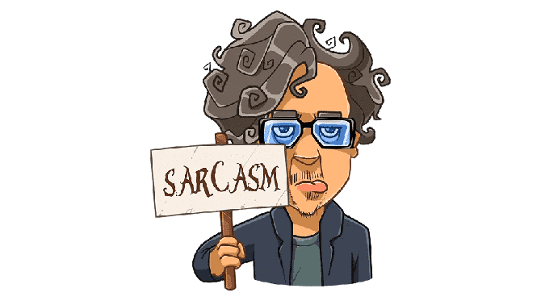
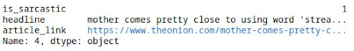
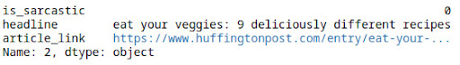
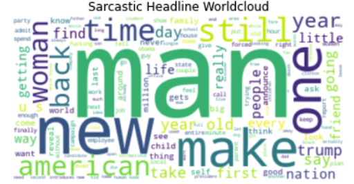
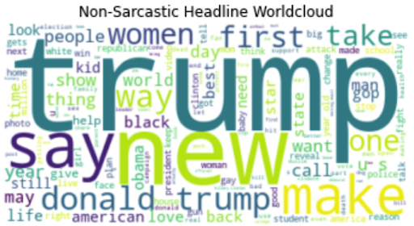
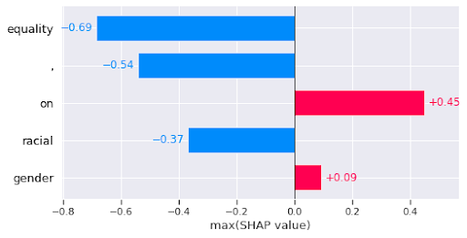

## Sarcasm Detection For News Headlines
This **data science project** attempts to use **different machine learning models** to detect if a given news headline is sarcastic or not. Given the nature of this task, most **models are classifiers** with two classifications. This project does attempt to use regression models to calculate how sarcastic or not sarcastic a given news headline is.

<!-- 

 -->

## Background On Sarcasm
Sarcasm is a form of **verbal irony** that conveys meanings opposite to its literal interpretation. In its base sense it presents a **significant challenge in natural language model detection**. Natural Language Processing Researchers have introduced machine learning and statistical tests to tackle the complex task of sarcasm detection. These tests have yielded promising and positive results because of the advent of large-scale annotated datasets. 

**Researchers have explored** various machine learning algorithms, including support vector machines, decision trees, and recurrent neural networks, to discern the underlying patterns and features that differentiate sarcastic statements from literal ones. Additionally, statistical tests, such as chi-square tests and t-tests, have been employed to assess the significance of linguistic features and provide insights into the effectiveness of sarcasm detection models.

## A Few Reference Research Publications:
- [Sarcasm detection of tweets: A comparative study](https://ieeexplore.ieee.org/document/8284317)
- [Automatic Sarcasm Detection: A Survey](https://dl.acm.org/doi/abs/10.1145/3124420)
- [On the naturalness of software](https://dl.acm.org/doi/abs/10.1145/2902362)
- [On the naturalness of fuzzer-generated code](https://dl.acm.org/doi/abs/10.1145/3524842.3527972)
- [Automatic hate speech detection using killer natural language processing optimizing ensemble deep learning approach](https://link.springer.com/article/10.1007/s00607-019-00745-0)

## The Dataset

For this project, a **5.75 MB news headline dataset** was obtained from Kaggle ([dataset link](https://www.kaggle.com/datasets/rmisra/news-headlines-dataset-for-sarcasm-detection)). There are close to **30,000 news headlines/records** in the dataset. Each news headline has a similar format. The news headlines were obtained **from The Onion and Huffington Post**.

Each attribute in the format: 

**Parameter: `is_sarcastic`**  
**Type: `int`** 
The value is 1 if the record is sarcastic and 0 otherwise.

**Parameter: `headline`**  
**Type: `string`** 
The headline of the news article

**Parameter: `article_link`**  
**Type: `string`** 
Link to the original news article. Useful for collecting supplementary data. There was no additional supplementary data collected or used. That would be a useful extension of this project.

The dataset was complied using various [twitter datasets](https://www.kaggle.com/datasets/kazanova/sentiment140) with the earliest record dated back to 2016 and the youngest dated in 2020. Assuming no strong drift in the definition of sarcasm or the use of sarcasm in news headlines, all of the models should be applicable to news headlines posted since 2020.

## Sample Dataset Records and Word Clouds
**Sarcastic Record Example**

<!-- 

 -->

**Non-Sarcastic Record Example**

<!-- 

 -->

**Word Cloud of Sarcastic Headlines**

<!-- 

 -->

**Word Cloud of Non-Sarcastic Headlines**

<!-- 

 -->

\* *Although Donald Trump is often made of fun by news headlines, we concluded that his name was the most prominent word in the non-sarcastic headlines as he was president during the time period that the dataset was complied from. We assume this news articles were serious reports of international relations and government announcements.*

## Types of Models Used
The models are organized from simplest to most complex.

**`Logistic Regression`**  
Read more about [Logistic Regression](https://en.wikipedia.org/wiki/Logistic_regression)

Check out the code [here](Logistic%20Regression/Logistic%20regression.ipynb)

**`Naive Bayes`**  
Read more about [Naive Bayes](https://en.wikipedia.org/wiki/Naive_Bayes_classifier)

Check out the code [here](Naive%20Bayes/NaiveBayes.ipynb)

**`kNN`**  
Read more about [kNN](https://en.wikipedia.org/wiki/K-nearest_neighbors_algorithm)

Check out the code [here](KNN/KNN.ipynb)

**`Random Forest`**  
Read more about [Random Forest](https://en.wikipedia.org/wiki/Random_forest)

Check out the code [here](Random%20Forest/RandomForest.ipynb)

**`XGBoost`**  
Read more about [XGBoost](https://en.wikipedia.org/wiki/XGBoost)

Check out the code [here](G%20Boost/XGBoost.ipynb)

**`Convolutional Neural Network (CNN)`**  
Read more about [Convolutional Neural Network](https://en.wikipedia.org/wiki/Convolutional_neural_network)

Check out the code [here](Neural%20Networks/NN.ipynb)

Full Model [here](Neural%20Networks/CNN_model.hdf5)

**`Gate Recurrent Unit (GRU)`**  
Read more about [Gate Recurrent Unit](https://en.wikipedia.org/wiki/Gated_recurrent_unit)

Check out the code [here](Neural%20Networks/NN.ipynb)

Full Model [here](Neural%20Networks/GRU_model.hdf5)

**`Long Short-Term Memory (LTSM)`**  
Read more about [Long Short-Term Memory](https://en.wikipedia.org/wiki/Long_short-term_memory)

Check out the code [here](Neural%20Networks/NN.ipynb)

Full Model [here](Neural%20Networks/LSTM_model.hdf5.zip)

**`Bidirectional Encoder Representations from Transformers (BERT)`** 
Read more about [BERT](https://en.wikipedia.org/wiki/BERT_(language_model))

Check out the code [here](PyTorch%20and%20SHAP%20using%20BERT/pytorch%20and%20shap.ipynb)

## Performance of Models

        |     Model      | Sarcastic/Humorous Headlines | NOT Sarcastic/Humorous Headlines | Precision | Recall | F1-Score |
        |:--------------:|:----------------------------:|:--------------------------------:|:---------:|:------:|:--------:|
        |  Naive Bayes   |            0.70             |              0.18               |    0.29   |  0.56  |   0.93   |
        |      kNN       |            0.53             |              0.42               |    0.47   |  0.56  |   0.67   |
        |    XGBoost     |            0.63             |              0.42               |    0.50   |  0.59  |   0.78   |
        | Logistic Reg.  |            0.79             |              0.41               |    0.54   |  0.63  |   0.90   |
        | Random Forest  |            0.62             |              0.55               |    0.59   |  0.63  |   0.70   |
        |      CNN       |            0.78             |              0.84               |    0.81   |  0.84  |   0.78   |
        |      GRU       |            0.84             |              0.81               |    0.83   |  0.83  |   0.86   |
        |     LSTM       |            0.82             |              0.84               |    0.83   |  0.85  |   0.82   |
        |     BERT       |            0.92             |              0.96               |    0.94   |  0.92  |   0.91   |

The first two columns after model are accuracy. The values above are computed using the formulas below

`Accuracy` = (True Positive + True Negative) / (True Positive + False Positive + True Negative + False Negative)

`Precision` = True Positive / (True Positive + False Positive)

`Recall` = True Positive / (True Positive + False Negative)

`F1 Score` = 2 * (`Precision` * `Recall`) / (`Precision` + `Recall`)

Read more about each of the metrics here [Accuracy](https://en.wikipedia.org/wiki/Accuracy_and_precision), [Precision](https://www.youtube.com/watch?v=dQw4w9WgXcQ), [Recall](https://en.wikipedia.org/wiki/Precision_and_recall), and [F1 Score](https://en.wikipedia.org/wiki/F-score).

## Discussion
As seen above in the models performance, the **best models are neural networks**. In some situations with data exploration, the difference between a linear/logistic regression and a massive neural networks is something on the magnitude of 5-10% in accuracy difference. The difference here is quite noticeable. It is also interesting to spot that on average **as the complexity of the model increases so does all measured metrics**. We assume that as speech and language inflections like **sarcasm** are **high complex and context variant** a model high complexity would perform well. 

Out of all models, the **BERT model is best performing** and the most complex as it required fine tuning on an existing transformer. The CNN, GRU, and LSTM were all trained from scratch. **BERT can be combined with the SHAP Explainer** that will point all the significance of each part of a record after a regression is made. Here is an example of that working. **Feature extractors** like this explainer help to gain a better understanding why a larger or more complex model performs better. They highlight exactly what the model sees when making predictions.

<!-- 

 -->

The observation here is that some more some in the headline have a much greater impact on the eventual regression.

## Future Steps
1. **Repeat entire analysis with TF-IDF Data Encoding**
    - The current analysis was made using a N-Gram encoding

2. **Refine Neural Network Models (CNN, GRU, LSTM)**
    - These models performed well, but the layer size and model architecture were chosen arbitrarily
    - To maximize performance for these smaller models, multiple models with slightly differing architecture should be trained and tested

3. **Enhance Neural Network models through web-scraping article content using each observations’ hyperlink**
    - As stated earlier, each record in the news headlines dataset contains a link to the original news article
    - To make a more accurate prediction on the sarcasm or non-sarcasm decision on the article, the article can be scraped for their content
    - The content can be fed into the same models in a similar way to the way ensemble models work
    - It would be interesting to do sentiment analysis for polarity and subjectivity to see if those metrics correlate with sarcasm/non-sarcasm classifications

4. **Investigate Word2Vec Encoding**
    - Word2vec is a group of related models that are used to produce word embeddings
    - It has been used for similar text signal detection and classification
    - It would most likely perform better than any of the Neural Network models

5. **Enhance the BERT encoder**
    - The BERT model was fine tuned, but possibly not in way that maximized performance
    - Different fine tuning attempts could yield a better performing model 

## Acknowledgements
This project was put together by the The Anti-Sarcasm Sarcastic Club. This club includes [John Billos](https://www.linkedin.com/in/john-billos/), [Yusuf Ismail](https://www.linkedin.com/in/yusuf-ismail/), [Albert Jing](https://www.linkedin.com/in/albert-jing-978a47209/), [Geoffrey Jing](https://www.linkedin.com/in/geoffreyjing/?trk=public_profile_browsemap), and [Christopher Moppel](https://www.linkedin.com/in/christopher-moppel/) for the Data Science final project during a Fall 2022 semester at the Aquincum Institute of Technology in Budapest, Hungary. Huge shout out to [Roland Molontay](https://math.bme.hu/~molontay/) for the guidance on this project.